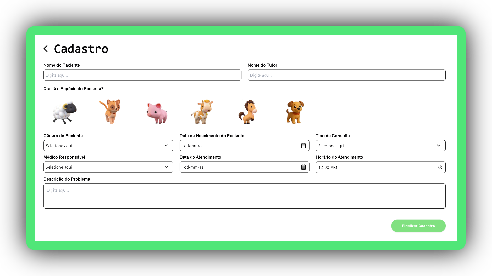
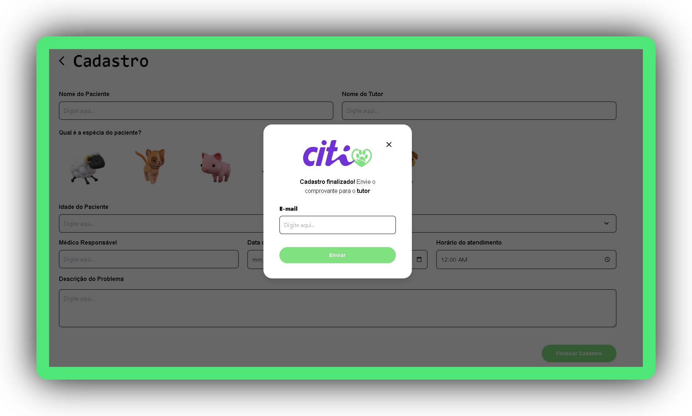

# Documentação do Componente de Cadastro

Este documento descreve o funcionamento do componente de cadastro. Ele é construído com **React** (Next.js) e **Tailwind CSS**, utilizando componentes personalizados e gerenciamento de estado via `useState`.

---

## 📁 Estrutura dos Arquivos:

```bash
/components/
  /animalSelector.tsx
  /registerModal.tsx
  /registerForm.tsx
```

---

## 📌 Descrição Geral:

O componente principal é `Register`, que inclui um formulário de cadastro (`Form`) e um modal (`RegisterModal`).
O formulário permite a inserção de dados do paciente animal, como `nome`, `tutor`, `espécie`, `tipo de consulta`, entre outros.


---


---

## 🧩 Componentes Utilizados:

- `AnimalSelector`: Componente customizado para seleção de espécie do animal.
- `RegisterModal`: Modal de confirmação após o cadastro.

---

## 🪪 Register:

```tsx
export default function Register() {
  return (
    <div>
      <Form />
      <RegisterModal />
    </div>
  );
}
```

Renderiza o formulário de cadastro e o modal.

---

## 📝 Form:

```tsx
function Form() {
  ...
}
```

Este componente contém o formulário principal, incluindo os seguintes campos:

### Estados
```tsx
const [especieSelecionada, setEspecieSelecionada] = useState<string | null>(null);
```

Armazena a espécie selecionada no `AnimalSelector`.

### Função
```tsx
const handleSelecionarEspecie = (especie: string) => {
  if (especieSelecionada === especie) {
    setEspecieSelecionada(null);
  } else {
    setEspecieSelecionada(especie);
  }
};
```

Alterna a seleção da espécie do paciente.

---

## 📋 Campos do Formulário


1. **Informações do Paciente e Tutor:**
   • Nome do Paciente;
   • Nome do Tutor.

2. **Espécie do Paciente:**
   • Usa o componente `AnimalSelector`.

3. **Informações Complementares:**
   • Idade do Paciente;
   • Tipo de Consulta;
   • Médico Responsável;
   • Data do Atendimento;
   • Horário do Atendimento.

5. **Descrição do Problema:**
   • Campo de texto livre.

---

## 🎨 Estilização

Estilos são definidos utilizando o `Tailwind CSS`.
